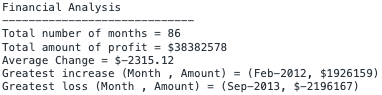

# Console Financial Analysis: Module 4 Challenge

## Description 

This project involved employing a number of javascript functions and concepts to perform calculatiions based on a set of values in an array.

## Installation
<br>

1. Navigate to the repository using the link below: 

```sh
   https://github.com/yasmiinLDN/Yasmiin-Console-Finances
   ```
<br>

2. Click the green "< > Code" button to copy the SSH key related to the repository
<br>
<br>
<br>
3. Clone the repository into your local machine using the below command entered into the command line (assuming you have set up your SSH connection correctly to connect your GitHub account to your local machine):

```sh
   git clone git@github.com:yasmiinLDN/Yasmiin-Console-Finances.git
   ```
<br>


## Usage 

Below shows the layout of the final console:




## Credits

This document was created with assistance from the following websites and Tutors:

https://developer.mozilla.org/en-US/docs/Web/JavaScript
<br>
Bobbi Tarkany

## License

This document is distributed under the MIT License. Please see LICENSE.txt for more information.

## Badges

| HTML5            |    
| Javascript            |    


## Features

### Main console contents
- Total number of months
- Total amount of profit
- Average Change 
- Greatest increase (Month , Amount)
- Greatest loss (Month , Amount)

## Contributing

  

